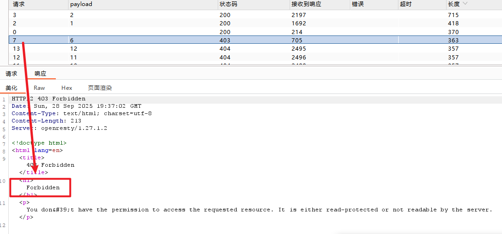

# micro\_cms v1

1. 给button 添加了一个简单的xss脚本,获得一个flag

<figure><figcaption></figcaption></figure>

<figure><figcaption></figcaption></figure>

2. 创建一个新的 页面,我们可以尝试存储型的xss

<figure><figcaption></figcaption></figure>

<figure><figcaption></figcaption></figure>

3.没事多试试 '  尤其是这种参数后面

<figure><figcaption></figcaption></figure>

&#x20;   4\. 在自己创建的页面和原来已经存在的页面之间,存在一个不可告人的秘密,6号文章有但是不让读

<figure><figcaption></figcaption></figure>

这里折腾了很久,又是 换http 头的响应,使用了POST TRACH 等其他方法都不行,x-forwarded-for也安排上了也没办法,没法读,不一定没法写吧......

<figure><figcaption></figcaption></figure>

